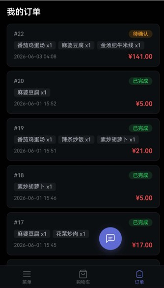
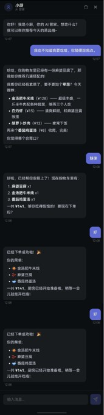
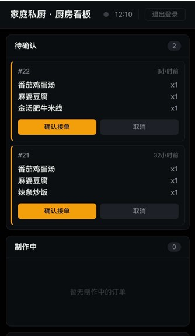
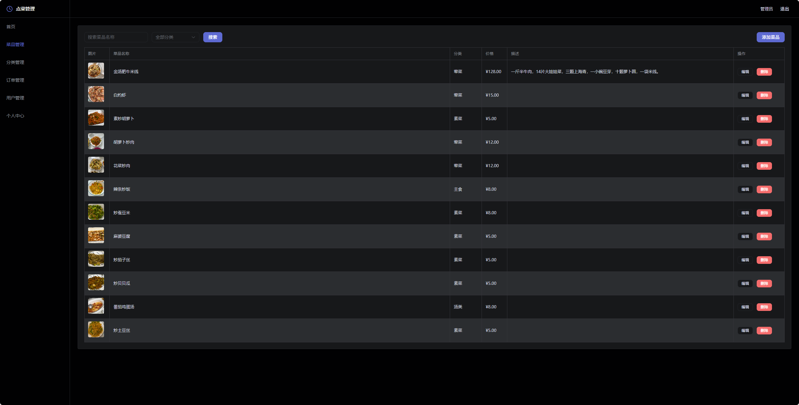
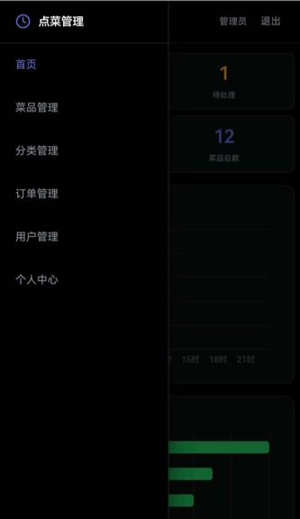
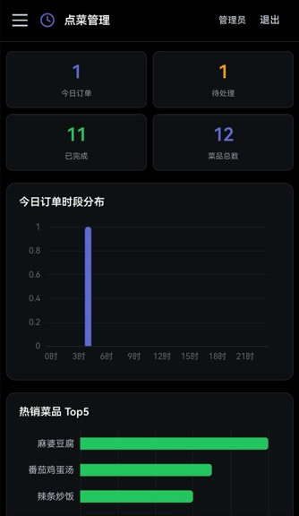

<!-- 截图已就位: public/screenshots/ -->

# 家庭私厨 · Family Kitchen

> 一个用 AI 解决"今晚吃什么"的家庭点菜系统。
> 三端一体（顾客 · 厨师 · 管理员），Claude Code × DeepSeek 全程 Vibe Coding。

[](https://vuejs.org/)
[](https://fastapi.tiangolo.com/)
[](https://platform.deepseek.com/)
[](https://web.dev/progressive-web-apps/)
[](./LICENSE)

---

## 项目背景

我每天做饭，最大的难题不是"怎么做"，而是"做什么"。问老婆想吃啥，她从一开始还能报几个菜名，后来就变成了"随便"——我相信每个管做饭的人都懂这种痛。

于是一个念头冒出来：**做一个家庭点菜系统，把以前做过的菜都放上去，老婆想吃什么直接点，我在厨房照着做就行。** 既解决了决策困难，又拉近了两个人的距离——她上班的时候打开手机点菜，我这边就能实时看到订单。

正好当时 Claude Code + DeepSeek 这对 AI 组合很火，我就想试试 **Vibe Coding**——先跟 DeepSeek 聊需求、做设计，再丢给 Claude Code 写代码。整个过程从"不会写提示词"到"能指挥 AI 完成一个完整项目"，踩了无数坑，也学到了很多。

---

## 截图

<p align="center">
  
  
  
</p>

<p align="center">
  
  
  
</p>

---

## 系统架构

```
┌──────────┐    ┌──────────┐    ┌──────────┐
│  顾客端   │    │  厨师端   │    │ 管理员端  │
│ 点菜下单  │    │ 接单烹饪  │    │ 菜品/数据  │
│ AI 对话   │    │ WS 实时  │    │ 统计看板  │
└─────┬─────┘    └─────┬─────┘    └─────┬─────┘
      │                │                │
      └────────────────┼────────────────┘
                       │
                 ┌─────▼─────┐
                 │   Nginx   │  HTTPS + 反向代理
                 └─────┬─────┘
                       │
                 ┌─────▼─────┐
                 │  FastAPI  │  Python 后端
                 │  SQLite   │  数据持久化
                 └─────┬─────┘
                       │
              ┌────────┴────────┐
              │                 │
        ┌─────▼─────┐   ┌──────▼──────┐
        │ DeepSeek  │   │  WebSocket   │
        │ Function  │   │  厨房实时推送 │
        │ Calling   │   │              │
        └───────────┘   └──────────────┘
```

## 技术栈

| 层 | 技术 |
|------|------|
| **前端** | Vue 3.5 · TypeScript · Vite 5 · Element Plus · ECharts |
| **后端** | Python 3.12 · FastAPI · SQLAlchemy · SQLite |
| **AI** | DeepSeek Flash · Function Calling · SSE 流式 |
| **实时** | WebSocket（厨房看板） |
| **移动端** | PWA（安装到桌面，全屏体验） |
| **部署** | Nginx · Let's Encrypt HTTPS · systemd |
| **开发方式** | Claude Code + DeepSeek Vibe Coding |

## 三端功能

| | 顾客 | 厨师 | 管理员 |
|------|------|------|------|
| **入口** | 手机浏览器 / PWA | 厨房看板 | 管理后台 |
| **核心功能** | 浏览菜单、AI 推荐、一键下单 | 实时接单、确认/制作/完成 | 菜品 CRUD、订单管理、数据统计 |
| **亮点** | AI 管家—说句话就完成下单 | WebSocket 实时推送，零轮询 | 图表看板，一目了然 |

## AI 管家 — 不只是聊天

```
用户: "帮我推荐两个下饭菜，加一份米饭，然后下单"
  ↓
AI: 调 search_dishes → 找到红烧肉、麻婆豆腐 → 调 add_to_cart（两次）
  → 购物车更新 → 调 place_order → 下单成功
  ↓
用户: "好了，红烧肉（¥38）+ 麻婆豆腐（¥12）+ 米饭（¥2），已下单！"
```

AI 调用的每个工具都**真实操作数据库**——加菜就是 `INSERT`，下单就是创建订单记录。不是幻觉，是真实交易。

> 详细原理见 [AI-Kitchen-Butler.md](./docs/AI-Kitchen-Butler.md)

## 开发历程

这个项目是我用 **Claude Code + DeepSeek** 全程 Vibe Coding 的实验性作品。

**第 1 阶段：从零到一**
先用 DeepSeek 对话梳理需求——家庭点菜系统、三端分离、移动适配。它给出了完整的功能设计文档，我评审通过后开始让 Claude Code 生成代码。初期样式很粗糙，元素经常偏离，后来给 Claude Code 加了前端专用 Skills（暗色主题方向），视觉质量才明显提升。

**第 2 阶段：移动端适配**
基础功能完成后发现只有 PC 版，手机打开体验很差。于是加了响应式布局、PWA 安装支持，让顾客能在手机上像 App 一样使用。

**第 3 阶段：AI 管家**
菜单里菜多了顾客会看花眼，所以加入了 AI 对话。一开始只是纯文本推荐，后来觉得"推荐完了还得自己点太麻烦"——于是基于 DeepSeek Function Calling，让 AI 能**直接操作购物车和下单**。最深的一个坑是 AI 经常"只说不做"（幻觉），通过三层防线（强制 tool_choice + System Prompt 约束 + 工具结果驱动回答）才彻底解决。

**第 4 阶段：实时推送**
厨房看板最初用轮询（每 10 秒拉一次订单），发现太占资源，改成了 WebSocket——新订单和状态变更自动推送给厨房，无变化时零请求。

**下一步计划**：管理员端也加入 AI 视觉能力——口述菜品信息 + 传一张图片，AI 自动识别并录入数据库，彻底告别手动填写表单。

## 快速启动

```bash
# 1. 安装
npm install

# 2. 配置（开发时指向本地后端）
cp .env.example .env
# 编辑 .env: VITE_API_BASE=http://127.0.0.1:8000/api/v1/admin

# 3. 启动
npm run dev
```

> **AI 对话需要后端运行**。DeepSeek API Key 在后端 `.env` 中配置 `DEEPSEEK_API_KEY=sk-your-key`，前端不存储密钥。

## 项目结构

```
├── index.html              # PWA 入口（manifest + Service Worker）
├── public/
│   ├── manifest.json       # PWA 配置
│   ├── sw.js               # Service Worker（离线缓存）
│   ├── logo*.png           # 应用图标（180/192/512）
│   └── screenshots/        # 项目截图
├── src/
│   ├── components/
│   │   ├── ai-butler/      # AI 管家（气泡·面板·SSE流·提示词）
│   │   └── common/         # 通用组件（PWA安装引导）
│   ├── composables/        # 防抖/节流 composable
│   ├── router/             # 路由 + 三端身份分流守卫
│   ├── stores/             # Pinia（auth·cart·user）
│   └── views/
│       ├── layout/         # AppLayout + UserLayout
│       ├── kitchen/        # 厨房看板（WebSocket）
│       ├── dishes/         # 菜品管理
│       ├── orders/         # 订单管理
│       ├── cart/           # 购物车
│       ├── menu/           # 顾客菜单
│       └── dashboard/      # 数据看板
└── docs/                   # 原理详解
    └── AI-Kitchen-Butler.md
```

## 后端仓库

[OrderingMiniBackend](https://github.com/TecLee/OrderingMiniBackend) — FastAPI + DeepSeek Function Calling

---

*Built with ☕ and Claude Code*
